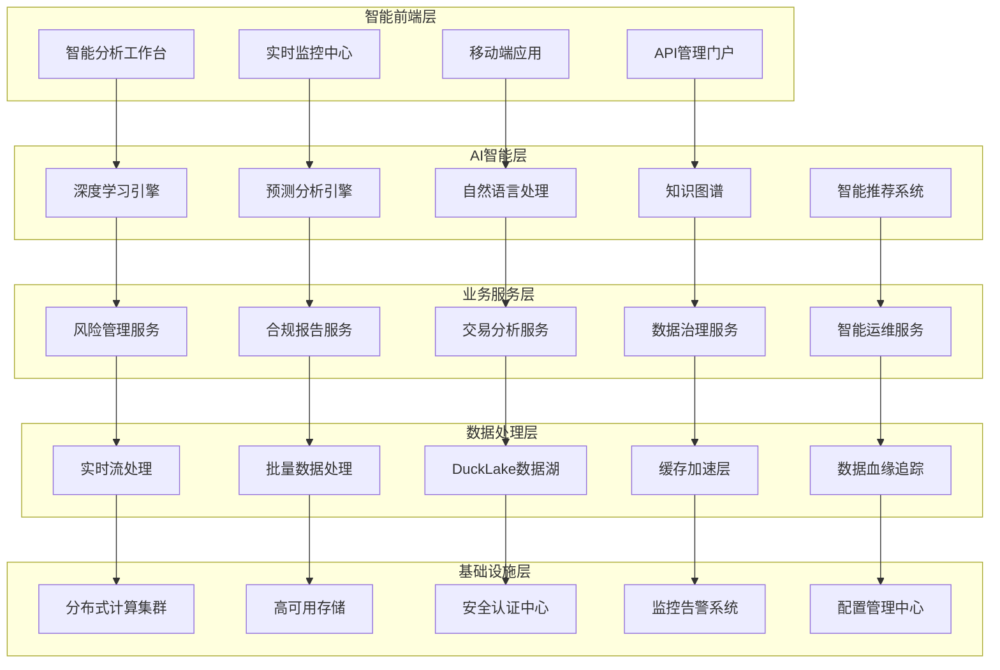

# 智能化AI Agent驱动的金融级数据平台设计文档

## 设计概述

基于现有DuckHub平台的强大基础，设计下一代智能化AI Agent驱动的金融级数据平台。该设计充分利用已有的95%完成度核心功能，通过智能化升级和金融业务深度集成，构建世界级的金融数据平台。

## 架构设计

### 整体架构



### 核心组件架构

#### 1. 智能AI Agent架构升级

**基于现有Rig框架的深度扩展**:

```rust
// 增强的AI Agent架构
pub struct IntelligentAIAgent {
    // 现有组件 (已实现)
    nlp_processor: Arc<NLPProcessor>,
    recommendation_engine: Arc<RecommendationEngine>,
    chat_processor: Arc<ChatProcessor>,
    
    // 新增智能组件
    deep_learning_engine: Arc<DeepLearningEngine>,
    prediction_engine: Arc<PredictionEngine>,
    knowledge_graph: Arc<KnowledgeGraph>,
    financial_analyzer: Arc<FinancialAnalyzer>,
    risk_detector: Arc<RiskDetector>,
    
    // 增强配置
    config: IntelligentAIConfig,
    metrics: IntelligentAIMetrics,
}

pub struct DeepLearningEngine {
    model_registry: ModelRegistry,
    training_pipeline: TrainingPipeline,
    inference_engine: InferenceEngine,
    model_versioning: ModelVersioning,
}

pub struct PredictionEngine {
    time_series_models: Vec<TimeSeriesModel>,
    risk_models: Vec<RiskModel>,
    market_models: Vec<MarketModel>,
    ensemble_methods: EnsembleMethods,
}
```

#### 2. 金融级实时数据处理架构

**基于现有DuckLake的流处理扩展**:

```rust
pub struct RealTimeFinancialProcessor {
    // 现有DuckLake管理器 (已实现)
    ducklake_manager: Arc<DuckLakeManager>,
    
    // 新增实时处理组件
    stream_processor: Arc<StreamProcessor>,
    risk_engine: Arc<RealTimeRiskEngine>,
    trade_analyzer: Arc<TradeAnalyzer>,
    market_data_handler: Arc<MarketDataHandler>,
    
    // 性能优化组件
    memory_pool: Arc<MemoryPool>,
    compute_scheduler: Arc<ComputeScheduler>,
    cache_optimizer: Arc<CacheOptimizer>,
}

pub struct StreamProcessor {
    kafka_consumers: Vec<KafkaConsumer>,
    processing_pipeline: ProcessingPipeline,
    backpressure_controller: BackpressureController,
    fault_tolerance: FaultTolerance,
}

pub struct RealTimeRiskEngine {
    risk_models: Vec<RiskModel>,
    threshold_monitor: ThresholdMonitor,
    alert_system: AlertSystem,
    auto_response: AutoResponse,
}
```

#### 3. 智能数据治理架构

**基于现有Schema管理的治理扩展**:

```rust
pub struct IntelligentDataGovernance {
    // 现有Schema管理器 (已实现)
    schema_manager: Arc<SchemaManager>,
    
    // 新增治理组件
    data_lineage_tracker: Arc<DataLineageTracker>,
    quality_monitor: Arc<DataQualityMonitor>,
    compliance_engine: Arc<ComplianceEngine>,
    metadata_manager: Arc<MetadataManager>,
    
    // 自动化治理
    auto_classification: Arc<AutoClassification>,
    policy_engine: Arc<PolicyEngine>,
    remediation_system: Arc<RemediationSystem>,
}

pub struct DataLineageTracker {
    lineage_graph: LineageGraph,
    impact_analyzer: ImpactAnalyzer,
    change_tracker: ChangeTracker,
    visualization_engine: VisualizationEngine,
}

pub struct DataQualityMonitor {
    quality_rules: Vec<QualityRule>,
    anomaly_detector: AnomalyDetector,
    quality_scorer: QualityScorer,
    report_generator: ReportGenerator,
}
```

## 组件和接口设计

### 1. 智能AI Agent接口

```rust
#[async_trait]
pub trait IntelligentAnalyzer {
    // 深度学习分析
    async fn deep_analyze(&self, data: &DataFrame, model_type: ModelType) -> Result<AnalysisResult>;
    
    // 预测分析
    async fn predict(&self, historical_data: &DataFrame, horizon: Duration) -> Result<PredictionResult>;
    
    // 风险评估
    async fn assess_risk(&self, portfolio: &Portfolio, market_data: &MarketData) -> Result<RiskAssessment>;
    
    // 异常检测
    async fn detect_anomalies(&self, data_stream: &DataStream) -> Result<Vec<Anomaly>>;
    
    // 智能推荐
    async fn recommend_actions(&self, context: &AnalysisContext) -> Result<Vec<Recommendation>>;
}

#[derive(Debug, Serialize, Deserialize)]
pub struct AnalysisResult {
    pub analysis_id: String,
    pub model_used: String,
    pub confidence_score: f64,
    pub insights: Vec<Insight>,
    pub visualizations: Vec<Visualization>,
    pub recommendations: Vec<Recommendation>,
    pub execution_time_ms: u64,
}

#[derive(Debug, Serialize, Deserialize)]
pub struct PredictionResult {
    pub prediction_id: String,
    pub forecast_values: Vec<ForecastPoint>,
    pub confidence_intervals: Vec<ConfidenceInterval>,
    pub model_accuracy: f64,
    pub feature_importance: HashMap<String, f64>,
    pub risk_factors: Vec<RiskFactor>,
}
```

### 2. 实时数据处理接口

```rust
#[async_trait]
pub trait RealTimeProcessor {
    // 实时数据摄取
    async fn ingest_stream(&self, stream: DataStream) -> Result<ProcessingHandle>;
    
    // 实时风险监控
    async fn monitor_risk(&self, portfolio: &Portfolio) -> Result<RiskMonitorHandle>;
    
    // 实时交易分析
    async fn analyze_trades(&self, trade_stream: &TradeStream) -> Result<TradeAnalysisResult>;
    
    // 实时告警
    async fn trigger_alert(&self, alert: Alert) -> Result<AlertResponse>;
    
    // 性能监控
    async fn get_processing_metrics(&self) -> Result<ProcessingMetrics>;
}

#[derive(Debug, Serialize, Deserialize)]
pub struct ProcessingMetrics {
    pub throughput_per_second: u64,
    pub latency_percentiles: LatencyPercentiles,
    pub error_rate: f64,
    pub memory_usage: MemoryUsage,
    pub cpu_utilization: f64,
}

#[derive(Debug, Serialize, Deserialize)]
pub struct TradeAnalysisResult {
    pub trade_id: String,
    pub risk_score: f64,
    pub compliance_status: ComplianceStatus,
    pub market_impact: MarketImpact,
    pub execution_quality: ExecutionQuality,
    pub recommendations: Vec<TradeRecommendation>,
}
```

### 3. 数据治理接口

```rust
#[async_trait]
pub trait DataGovernanceManager {
    // 数据血缘追踪
    async fn trace_lineage(&self, data_asset: &DataAsset) -> Result<LineageGraph>;
    
    // 数据质量评估
    async fn assess_quality(&self, dataset: &Dataset) -> Result<QualityReport>;
    
    // 合规性检查
    async fn check_compliance(&self, data_operation: &DataOperation) -> Result<ComplianceReport>;
    
    // 自动分类
    async fn classify_data(&self, data: &DataFrame) -> Result<DataClassification>;
    
    // 策略执行
    async fn enforce_policy(&self, policy: &DataPolicy, data: &DataFrame) -> Result<PolicyResult>;
}

#[derive(Debug, Serialize, Deserialize)]
pub struct LineageGraph {
    pub nodes: Vec<LineageNode>,
    pub edges: Vec<LineageEdge>,
    pub metadata: LineageMetadata,
    pub impact_analysis: ImpactAnalysis,
}

#[derive(Debug, Serialize, Deserialize)]
pub struct QualityReport {
    pub overall_score: f64,
    pub dimension_scores: HashMap<String, f64>,
    pub issues: Vec<QualityIssue>,
    pub recommendations: Vec<QualityRecommendation>,
    pub trend_analysis: TrendAnalysis,
}
```

## 数据模型设计

### 1. 金融数据模型

```rust
// 增强的金融交易模型
#[derive(Debug, Serialize, Deserialize, Clone)]
pub struct EnhancedTransaction {
    // 基础字段
    pub transaction_id: Uuid,
    pub account_id: String,
    pub symbol: String,
    pub transaction_type: TransactionType,
    pub quantity: Decimal,
    pub price: Decimal,
    pub timestamp: DateTime<Utc>,
    
    // 增强字段
    pub market_data: MarketData,
    pub risk_metrics: RiskMetrics,
    pub compliance_flags: Vec<ComplianceFlag>,
    pub execution_context: ExecutionContext,
    pub ai_insights: Option<AIInsights>,
}

#[derive(Debug, Serialize, Deserialize, Clone)]
pub struct MarketData {
    pub bid_price: Decimal,
    pub ask_price: Decimal,
    pub volume: u64,
    pub volatility: f64,
    pub market_cap: Option<Decimal>,
    pub sector: String,
    pub market_indicators: HashMap<String, f64>,
}

#[derive(Debug, Serialize, Deserialize, Clone)]
pub struct RiskMetrics {
    pub var_95: Decimal,
    pub var_99: Decimal,
    pub expected_shortfall: Decimal,
    pub beta: f64,
    pub sharpe_ratio: f64,
    pub max_drawdown: f64,
    pub correlation_matrix: HashMap<String, f64>,
}
```

### 2. AI模型数据结构

```rust
#[derive(Debug, Serialize, Deserialize, Clone)]
pub struct AIModel {
    pub model_id: String,
    pub model_type: ModelType,
    pub version: String,
    pub training_data: TrainingDataInfo,
    pub performance_metrics: ModelPerformance,
    pub deployment_status: DeploymentStatus,
    pub created_at: DateTime<Utc>,
    pub updated_at: DateTime<Utc>,
}

#[derive(Debug, Serialize, Deserialize, Clone)]
pub struct ModelPerformance {
    pub accuracy: f64,
    pub precision: f64,
    pub recall: f64,
    pub f1_score: f64,
    pub auc_roc: f64,
    pub validation_metrics: HashMap<String, f64>,
    pub backtesting_results: Option<BacktestingResults>,
}

#[derive(Debug, Serialize, Deserialize, Clone)]
pub struct PredictionOutput {
    pub prediction_id: String,
    pub model_id: String,
    pub input_features: HashMap<String, f64>,
    pub predicted_value: f64,
    pub confidence_score: f64,
    pub prediction_interval: (f64, f64),
    pub feature_importance: HashMap<String, f64>,
    pub explanation: String,
}
```

### 3. 数据治理模型

```rust
#[derive(Debug, Serialize, Deserialize, Clone)]
pub struct DataAsset {
    pub asset_id: String,
    pub name: String,
    pub description: String,
    pub data_type: DataType,
    pub schema: DataSchema,
    pub lineage: DataLineage,
    pub quality_score: f64,
    pub classification: DataClassification,
    pub compliance_status: ComplianceStatus,
    pub access_controls: AccessControls,
    pub metadata: HashMap<String, Value>,
}

#[derive(Debug, Serialize, Deserialize, Clone)]
pub struct DataLineage {
    pub upstream_assets: Vec<String>,
    pub downstream_assets: Vec<String>,
    pub transformations: Vec<Transformation>,
    pub data_flow: DataFlow,
    pub impact_radius: u32,
}

#[derive(Debug, Serialize, Deserialize, Clone)]
pub struct DataQualityMetrics {
    pub completeness: f64,
    pub accuracy: f64,
    pub consistency: f64,
    pub timeliness: f64,
    pub validity: f64,
    pub uniqueness: f64,
    pub overall_score: f64,
    pub trend: QualityTrend,
}
```

## 错误处理设计

### 1. 分层错误处理

```rust
#[derive(Debug, thiserror::Error)]
pub enum IntelligentPlatformError {
    // AI相关错误
    #[error("AI模型错误: {message}")]
    AIModelError { message: String, model_id: String },
    
    #[error("预测分析失败: {reason}")]
    PredictionError { reason: String, context: String },
    
    // 实时处理错误
    #[error("实时处理超时: {timeout_ms}ms")]
    ProcessingTimeout { timeout_ms: u64 },
    
    #[error("流处理错误: {stream_id}")]
    StreamProcessingError { stream_id: String, cause: String },
    
    // 数据治理错误
    #[error("数据质量检查失败: {quality_issue}")]
    DataQualityError { quality_issue: String },
    
    #[error("合规性验证失败: {compliance_rule}")]
    ComplianceError { compliance_rule: String },
    
    // 金融业务错误
    #[error("风险阈值超标: {risk_type}")]
    RiskThresholdExceeded { risk_type: String, current_value: f64, threshold: f64 },
    
    #[error("交易验证失败: {transaction_id}")]
    TransactionValidationError { transaction_id: String, reason: String },
}

// 错误恢复策略
pub struct ErrorRecoveryStrategy {
    pub retry_policy: RetryPolicy,
    pub fallback_action: FallbackAction,
    pub notification_policy: NotificationPolicy,
    pub escalation_rules: Vec<EscalationRule>,
}
```

### 2. 智能错误恢复

```rust
pub struct IntelligentErrorHandler {
    recovery_strategies: HashMap<ErrorType, ErrorRecoveryStrategy>,
    ml_predictor: Arc<ErrorPredictor>,
    auto_remediation: Arc<AutoRemediation>,
}

impl IntelligentErrorHandler {
    pub async fn handle_error(&self, error: &IntelligentPlatformError) -> Result<RecoveryAction> {
        // 1. 错误分类和严重性评估
        let error_classification = self.classify_error(error).await?;
        
        // 2. 预测错误影响范围
        let impact_prediction = self.ml_predictor.predict_impact(error).await?;
        
        // 3. 选择最佳恢复策略
        let recovery_strategy = self.select_recovery_strategy(&error_classification, &impact_prediction).await?;
        
        // 4. 执行自动修复
        let recovery_result = self.auto_remediation.execute_recovery(&recovery_strategy).await?;
        
        Ok(recovery_result)
    }
}
```

## 测试策略

### 1. AI模型测试

```rust
#[cfg(test)]
mod ai_model_tests {
    use super::*;
    
    #[tokio::test]
    async fn test_prediction_accuracy() {
        let model = create_test_prediction_model().await;
        let test_data = load_test_dataset("financial_data_2023.csv").await;
        
        let predictions = model.predict(&test_data).await.unwrap();
        
        // 验证预测准确性
        assert!(predictions.accuracy > 0.85);
        assert!(predictions.confidence_score > 0.8);
    }
    
    #[tokio::test]
    async fn test_risk_detection() {
        let risk_engine = create_test_risk_engine().await;
        let high_risk_portfolio = create_high_risk_portfolio();
        
        let risk_assessment = risk_engine.assess_risk(&high_risk_portfolio).await.unwrap();
        
        // 验证风险检测
        assert!(risk_assessment.risk_level == RiskLevel::High);
        assert!(!risk_assessment.alerts.is_empty());
    }
}
```

### 2. 性能测试

```rust
#[cfg(test)]
mod performance_tests {
    use super::*;
    use criterion::{criterion_group, criterion_main, Criterion};
    
    fn benchmark_real_time_processing(c: &mut Criterion) {
        let rt = tokio::runtime::Runtime::new().unwrap();
        let processor = rt.block_on(create_test_processor());
        
        c.bench_function("real_time_processing_1M_records", |b| {
            b.iter(|| {
                rt.block_on(async {
                    let data_stream = generate_test_stream(1_000_000);
                    let start = std::time::Instant::now();
                    processor.process_stream(data_stream).await.unwrap();
                    let duration = start.elapsed();
                    
                    // 验证性能要求: 100万条记录在1秒内处理完成
                    assert!(duration.as_secs() <= 1);
                })
            })
        });
    }
    
    criterion_group!(benches, benchmark_real_time_processing);
    criterion_main!(benches);
}
```

### 3. 集成测试

```rust
#[cfg(test)]
mod integration_tests {
    use super::*;
    
    #[tokio::test]
    async fn test_end_to_end_financial_analysis() {
        // 1. 设置测试环境
        let platform = create_test_platform().await;
        
        // 2. 模拟实时交易数据流
        let trade_stream = generate_realistic_trade_stream().await;
        
        // 3. 启动实时处理
        let processing_handle = platform.start_real_time_processing(trade_stream).await.unwrap();
        
        // 4. 等待处理完成
        tokio::time::sleep(Duration::from_secs(10)).await;
        
        // 5. 验证结果
        let analysis_results = platform.get_analysis_results().await.unwrap();
        assert!(!analysis_results.is_empty());
        
        // 6. 验证AI洞察
        let ai_insights = platform.get_ai_insights().await.unwrap();
        assert!(ai_insights.confidence_score > 0.8);
        
        // 7. 验证风险检测
        let risk_alerts = platform.get_risk_alerts().await.unwrap();
        assert!(risk_alerts.iter().all(|alert| alert.is_valid()));
    }
}
```

## 部署架构

### 1. 微服务部署

```yaml
# Kubernetes部署配置
apiVersion: apps/v1
kind: Deployment
metadata:
  name: intelligent-ai-agent
spec:
  replicas: 3
  selector:
    matchLabels:
      app: intelligent-ai-agent
  template:
    metadata:
      labels:
        app: intelligent-ai-agent
    spec:
      containers:
      - name: ai-agent
        image: duckhub/intelligent-ai-agent:latest
        resources:
          requests:
            memory: "4Gi"
            cpu: "2000m"
            nvidia.com/gpu: 1
          limits:
            memory: "8Gi"
            cpu: "4000m"
            nvidia.com/gpu: 1
        env:
        - name: MODEL_CACHE_SIZE
          value: "10GB"
        - name: GPU_MEMORY_FRACTION
          value: "0.8"
```

### 2. 分布式存储

```yaml
apiVersion: v1
kind: ConfigMap
metadata:
  name: ducklake-config
data:
  ducklake.conf: |
    # DuckLake分布式配置
    cluster:
      nodes: 5
      replication_factor: 3
      consistency_level: strong
    
    storage:
      backend: s3
      bucket: duckhub-financial-data
      encryption: aes256
      compression: zstd
    
    performance:
      cache_size: 50GB
      parallel_workers: 16
      batch_size: 10000
```

### 3. 监控和告警

```yaml
apiVersion: monitoring.coreos.com/v1
kind: ServiceMonitor
metadata:
  name: intelligent-platform-monitor
spec:
  selector:
    matchLabels:
      app: intelligent-platform
  endpoints:
  - port: metrics
    interval: 15s
    path: /metrics
---
apiVersion: monitoring.coreos.com/v1
kind: PrometheusRule
metadata:
  name: intelligent-platform-alerts
spec:
  groups:
  - name: ai-performance
    rules:
    - alert: AIModelAccuracyDrop
      expr: ai_model_accuracy < 0.85
      for: 5m
      labels:
        severity: warning
      annotations:
        summary: "AI模型准确率下降"
        description: "模型 {{ $labels.model_id }} 准确率降至 {{ $value }}"
```

## 安全设计

### 1. 多层安全架构

```rust
pub struct SecurityManager {
    // 身份认证
    auth_provider: Arc<AuthProvider>,
    // 访问控制
    rbac_engine: Arc<RBACEngine>,
    // 数据加密
    encryption_service: Arc<EncryptionService>,
    // 审计日志
    audit_logger: Arc<AuditLogger>,
    // 威胁检测
    threat_detector: Arc<ThreatDetector>,
}

impl SecurityManager {
    pub async fn secure_ai_inference(&self, request: &InferenceRequest) -> Result<SecureInferenceResult> {
        // 1. 身份验证
        let user = self.auth_provider.authenticate(&request.credentials).await?;
        
        // 2. 权限检查
        self.rbac_engine.check_permission(&user, "ai:inference", &request.model_id).await?;
        
        // 3. 数据脱敏
        let sanitized_data = self.sanitize_sensitive_data(&request.data).await?;
        
        // 4. 加密推理
        let encrypted_result = self.perform_encrypted_inference(&sanitized_data).await?;
        
        // 5. 审计记录
        self.audit_logger.log_inference(&user, &request, &encrypted_result).await?;
        
        Ok(encrypted_result)
    }
}
```

### 2. 数据隐私保护

```rust
pub struct PrivacyProtectionEngine {
    differential_privacy: Arc<DifferentialPrivacy>,
    homomorphic_encryption: Arc<HomomorphicEncryption>,
    secure_multiparty: Arc<SecureMultipartyComputation>,
    data_anonymizer: Arc<DataAnonymizer>,
}

impl PrivacyProtectionEngine {
    pub async fn privacy_preserving_analysis(&self, data: &SensitiveData) -> Result<AnalysisResult> {
        // 1. 差分隐私处理
        let dp_data = self.differential_privacy.add_noise(data, 0.1).await?;
        
        // 2. 同态加密计算
        let encrypted_result = self.homomorphic_encryption.compute(&dp_data).await?;
        
        // 3. 安全多方计算
        let secure_result = self.secure_multiparty.aggregate(&encrypted_result).await?;
        
        Ok(secure_result)
    }
}
```

## 性能优化设计

### 1. 智能缓存策略

```rust
pub struct IntelligentCacheManager {
    // 多级缓存
    l1_cache: Arc<MemoryCache>,      // 热数据缓存
    l2_cache: Arc<SSDCache>,         // 温数据缓存
    l3_cache: Arc<ObjectStorageCache>, // 冷数据缓存
    
    // 智能预测
    access_predictor: Arc<AccessPredictor>,
    cache_optimizer: Arc<CacheOptimizer>,
}

impl IntelligentCacheManager {
    pub async fn intelligent_get<T>(&self, key: &str) -> Result<Option<T>>
    where
        T: Serialize + DeserializeOwned + Clone,
    {
        // 1. 预测访问模式
        let access_pattern = self.access_predictor.predict_access(key).await?;
        
        // 2. 智能缓存策略
        match access_pattern.frequency {
            AccessFrequency::High => self.l1_cache.get(key).await,
            AccessFrequency::Medium => self.l2_cache.get(key).await,
            AccessFrequency::Low => self.l3_cache.get(key).await,
        }
    }
    
    pub async fn predictive_preload(&self) -> Result<()> {
        // 基于AI预测预加载数据
        let predictions = self.access_predictor.predict_future_access().await?;
        
        for prediction in predictions {
            if prediction.confidence > 0.8 {
                self.preload_data(&prediction.key).await?;
            }
        }
        
        Ok(())
    }
}
```

### 2. 自适应资源管理

```rust
pub struct AdaptiveResourceManager {
    resource_monitor: Arc<ResourceMonitor>,
    workload_predictor: Arc<WorkloadPredictor>,
    auto_scaler: Arc<AutoScaler>,
    resource_optimizer: Arc<ResourceOptimizer>,
}

impl AdaptiveResourceManager {
    pub async fn optimize_resources(&self) -> Result<OptimizationResult> {
        // 1. 监控当前资源使用
        let current_usage = self.resource_monitor.get_current_usage().await?;
        
        // 2. 预测未来工作负载
        let workload_prediction = self.workload_predictor.predict_workload().await?;
        
        // 3. 计算最优资源配置
        let optimal_config = self.resource_optimizer.calculate_optimal_config(
            &current_usage,
            &workload_prediction
        ).await?;
        
        // 4. 执行自动扩缩容
        let scaling_result = self.auto_scaler.scale_to_config(&optimal_config).await?;
        
        Ok(OptimizationResult {
            previous_config: current_usage,
            new_config: optimal_config,
            scaling_result,
            estimated_savings: self.calculate_cost_savings(&current_usage, &optimal_config).await?,
        })
    }
}
```

## 总结

这个设计文档基于现有DuckHub平台的强大基础，通过智能化升级和金融业务深度集成，构建了一个世界级的智能化AI Agent驱动的金融级数据平台。

**核心设计亮点**:

1. **充分利用现有基础** - 基于95%完成度的DuckLake、AI Agent、Web前端等核心功能
2. **智能化全面升级** - 深度学习、预测分析、知识图谱等AI能力
3. **金融级业务集成** - 风险管理、合规报告、实时交易分析
4. **企业级架构设计** - 分布式、高可用、安全合规
5. **性能优化策略** - 智能缓存、自适应资源管理、实时处理优化

该设计确保了平台的可扩展性、可维护性和高性能，为金融机构提供了完整的数据智能解决方案。